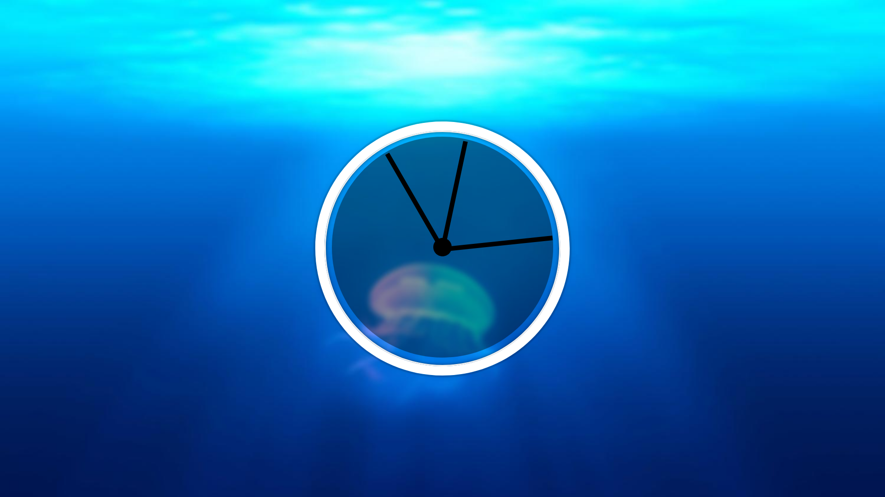

# JavaScript Clock

An analog clock built with HTML, CSS, and vanilla JavaScript. The clock reads the visitor's local system time and rotates three hands to represent the current hour, minute, and second.

This project is a practical exercise in working with time-based browser updates, DOM selection, inline styles, CSS transforms, and transform origins.

## Preview



## Features

- Displays the current local time in an analog-clock layout.
- Updates once every second.
- Uses separate hands for hours, minutes, and seconds.
- Uses CSS transitions to animate the movement of the hands.
- Has no framework, build step, or JavaScript dependencies.

## Running the Project

Open `index.html` in a modern web browser.

You can also run it through a local static server from this directory:

```bash
python3 -m http.server 8000
```

Then open `http://localhost:8000` in your browser. The clock uses the time configured on your device.

## Project Structure

```text
JavaScriptClock/
├── index.html   # Clock markup and JavaScript time logic
├── style.css    # Clock face, hands, positioning, and animation
├── project.png  # Project preview image
└── README.md    # Project documentation
```

## HTML Structure

The clock is made from nested `div` elements:

```html
<div class="clock">
  <div class="clock-face">
    <div class="clock_center"></div>
    <div class="hand hour-hand"></div>
    <div class="hand min-hand"></div>
    <div class="hand second-hand"></div>
  </div>
</div>
```

- `.clock` creates the circular outer frame.
- `.clock-face` is the inner circular area that holds all clock parts.
- `.clock_center` covers the meeting point of the three hands.
- Each `.hand` has a shared class for common styles and a specific class so JavaScript can update it independently.

## JavaScript Logic

The JavaScript is currently included at the bottom of `index.html`. Placing it after the page markup means the clock elements already exist when `querySelector()` runs.

### 1. Select the clock hands

```js
const secondHand = document.querySelector(".second-hand");
const minHand = document.querySelector(".min-hand");
const hourHand = document.querySelector(".hour-hand");
```

`document.querySelector()` returns the first element matching a CSS selector. These stored references let the program change each hand without searching the page again.

### 2. Read the current time

```js
const now = new Date();
const seconds = now.getSeconds();
const minutes = now.getMinutes();
const hours = now.getHours();
```

`new Date()` creates an object containing the current local date and time.

- `getSeconds()` returns a number from `0` to `59`.
- `getMinutes()` returns a number from `0` to `59`.
- `getHours()` returns a number from `0` to `23`.

### 3. Convert time values to rotation angles

One complete circle is `360` degrees. A traditional clock starts at 12 o'clock, while the default CSS rotation starts at 3 o'clock. Therefore, the project adds `90` degrees to every result.

```js
const secondsDegrees = (seconds / 60) * 360 + 90;
const minutesDegrees = (minutes / 60) * 360 + 90;
const hoursDegrees = (hours / 12) * 360 + 90;
```

The formula can be read as:

```text
(current value / number of positions) × 360 + starting offset
```

For example, at 15 seconds:

```text
(15 / 60) × 360 + 90 = 180 degrees
```

The seconds hand therefore points down at the 6 position.

### 4. Apply the rotation

```js
secondHand.style.transform = `rotate(${secondsDegrees}deg)`;
```

Template literals insert the calculated degree value into the CSS `rotate()` function. The same pattern is used for the minute and hour hands.

### 5. Repeat the update

```js
setInterval(setDate, 1000);
```

`setInterval()` calls `setDate` every 1,000 milliseconds, or once per second. This keeps the display aligned with the device time.

## CSS Concepts

### Creating the circular clock

The outer frame uses equal width and height with `border-radius: 50%` to create a circle. `position: relative` establishes a positioning context for elements inside it.

### Positioning the hands

```css
.hand {
  width: 50%;
  position: absolute;
  top: 50%;
  transform-origin: 100%;
}
```

Each hand is half the width of the clock face and begins vertically at the centre. `transform-origin: 100%` moves the pivot point to the far right end of the hand. Because the hand is positioned from the left, that right end aligns with the centre of the clock, creating a realistic rotating hand.

### Animating the hands

```css
transition-timing-function: cubic-bezier(0.1, 2.7, 0.58, 1);
```

This custom timing curve gives the clock hands a spring-like movement when their `transform` values change.

## Concepts to Revise

- The `Date` object and local time methods.
- DOM selection with `document.querySelector()`.
- Repeated execution with `setInterval()`.
- Turning a fraction of a full rotation into degrees.
- Updating inline CSS with `element.style.transform`.
- Template literals using backticks and `${value}`.
- Absolute positioning and `position: relative`.
- `transform-origin` and CSS rotation.
- CSS transitions and cubic-bezier timing functions.

## Potential Improvements

These are useful exercises after understanding the current version:

1. Call `setDate()` once before `setInterval()` so the hands are correct immediately when the page loads.
2. Include seconds in the minute-hand calculation and minutes in the hour-hand calculation for smoother, more accurate movement.
3. Remove `console.log(seconds)` after debugging.
4. Add hour markers or numbers to the clock face.
5. Add a digital time display and a dark-mode option.
6. Move the inline JavaScript into a separate `script.js` file as the project grows.

For smoother minute and hour hands, the calculations can be written as:

```js
const minutesDegrees = ((minutes + seconds / 60) / 60) * 360 + 90;
const hoursDegrees = (((hours % 12) + minutes / 60) / 12) * 360 + 90;
```

## Notes

The background image is currently loaded from an external Unsplash URL in `style.css`. If it does not load because of a network issue, the blue background colour remains visible. You can replace the URL with a local image file if you want the project to work completely offline.
